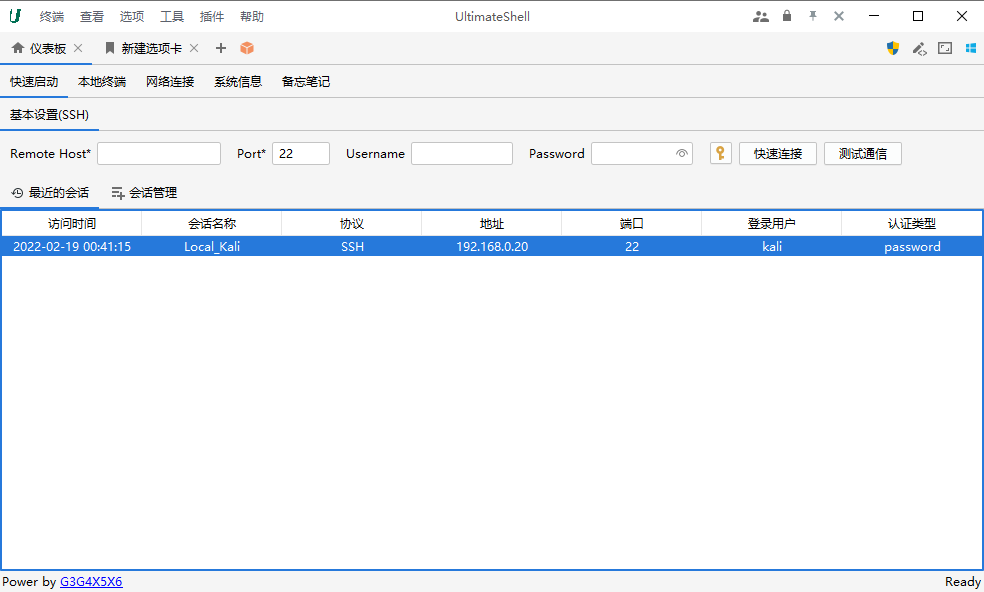
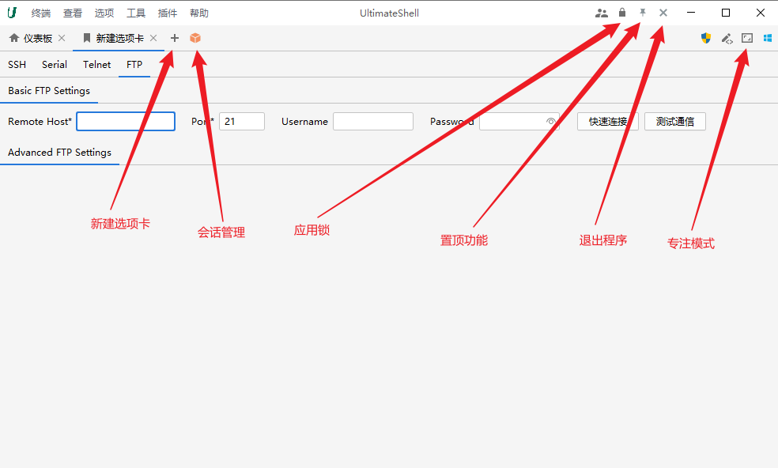
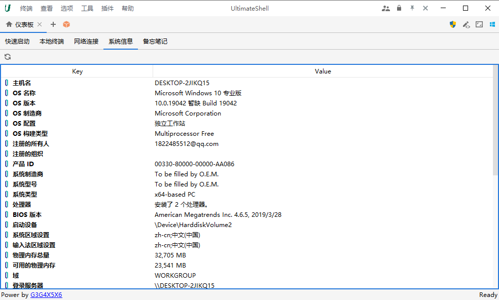
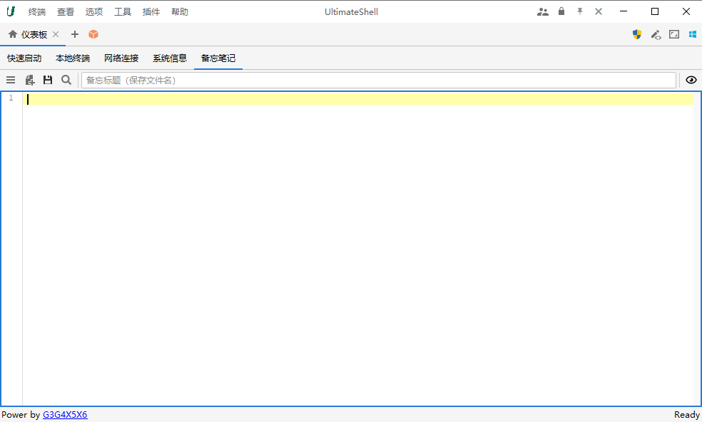
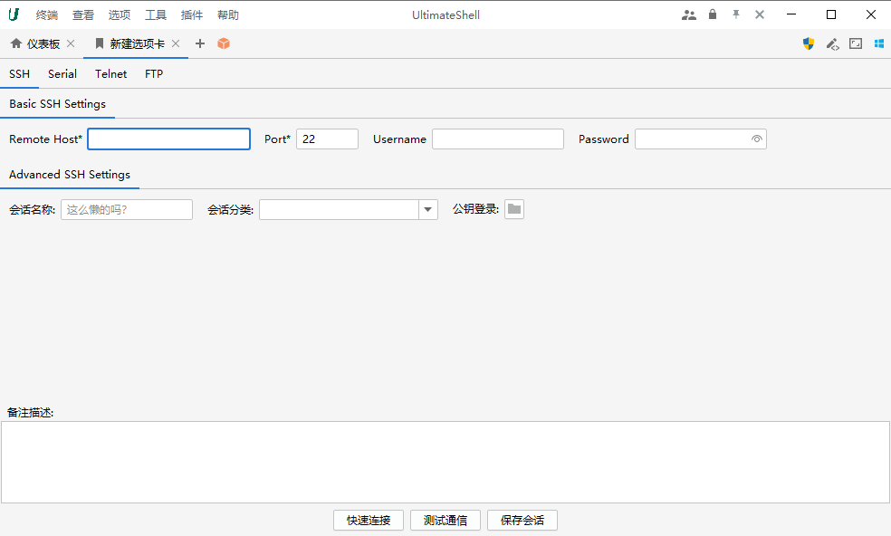
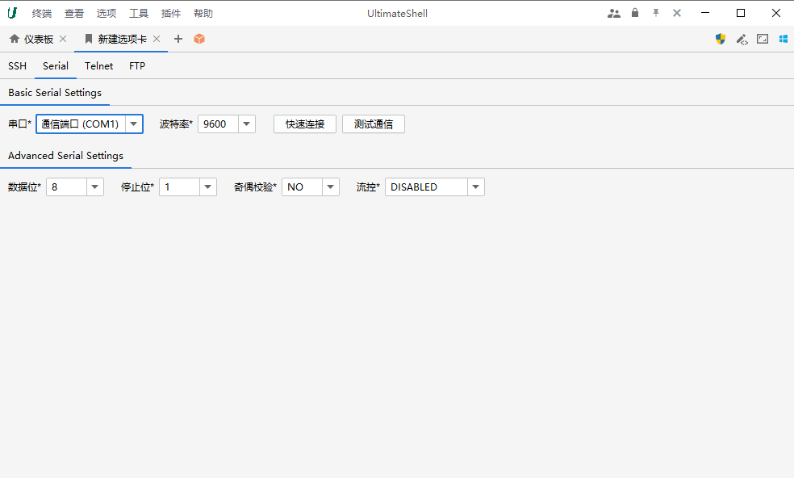
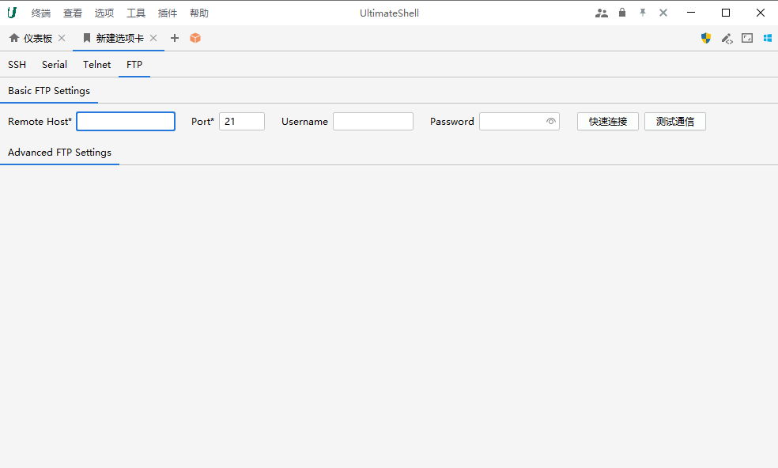

## :stadium: 仪表板

### 快速启动

### 本地终端

### 网络连接

### 系统信息

### 备忘笔记

## :rice:  SSH 功能

### 新建选项卡

- SSH 支持公钥登录。
- 会话分类以路径形式表达，如：local/centos/dev，表示该会话属于local分类下的子类centos下的子类dev。

### 专注功能

简陋版本，慢慢弄吧......

## :ram: RDP 功能

> RDP 功能依赖于 `xpack-tools` 增强包。

## :rat:  VNC 功能

>  调用内置的一个工具

## :radio: Serial 功能

>  只在模拟工具上测试过 `console` 连接，哪位有条件自己直接上机吧，有问题再反馈，over。

## :shrimp: Telnet 功能

>  暂不支持存储账号密码会话，在终端直接根据提示输入吧。

## :seedling: FTP 功能

> 暂未实现

