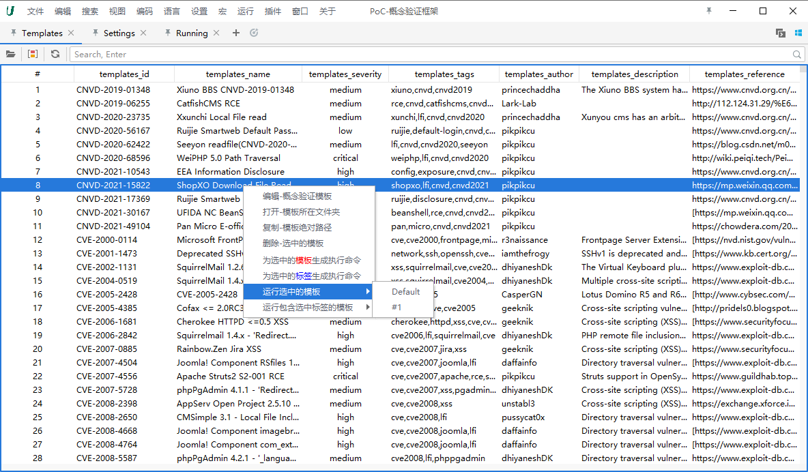

## :scissors:  外部工具集成

> 参考Wiki：[https://github.com/G3G4X5X6/ultimateshell/wiki/0x02-External-Tool-Integration](https://github.com/G3G4X5X6/ultimateshell/wiki/0x02-External-Tool-Integration)

点击 `工具管理`，会在 `简易编辑器` 中打开配置文件。

## :santa: 简易编辑器

## :snail: 概念验证框架(Nuclei)

