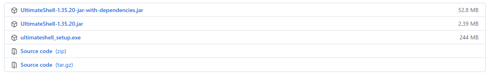

## :material-tag: 发布版本

1. `UltimateShell-x.x.x-jar-with-dependencies.jar` ：打包了完整的依赖包（平台通用）
2. `UltimateShell-x.x.x.jar` ：没有打包任何依赖包
3. `ultimateshell_setup.exe`：Windows安装程序（Windows专用）

## :fontawesome-brands-windows: Windows 安装

1. Windows `exe` 安装包
1. 

## :fontawesome-brands-linux: Linux 安装

## :fontawesome-brands-apple: MacOS 安装

